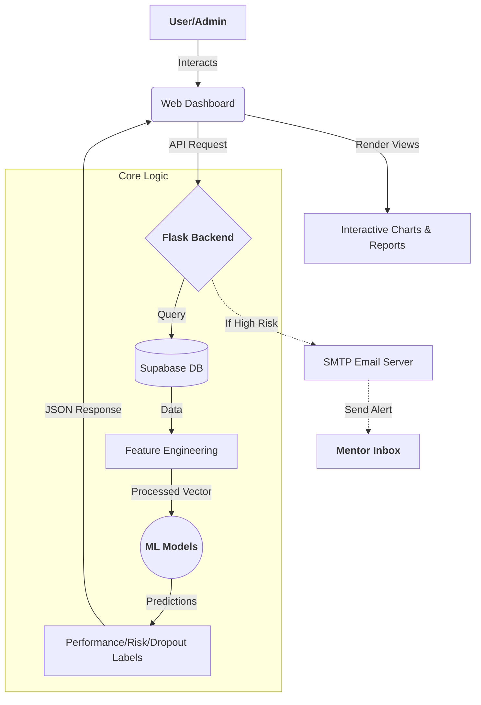

# 📊 EduMetric: Intelligent Student Performance Analytics
### *Predicting Success with Machine Learning & Advanced Analytics*

---

## 🌟 Project Overview
**EduMetric** is a state-of-the-art educational technology platform designed to transform how institutions track and improve student outcomes. By leveraging **Machine Learning (ML)**, the system predicts student performance, identifies potential dropouts, and assesses academic risk in real-time. This project bridges the gap between raw data and actionable educational insights.

---

## 🛠️ Technical Stack (The Engine)

### 🖥️ Frontend (User Interface)
*   **HTML5**: The foundation of the web pages, providing semantic structure.
    *   **What**: Standard markup language for documents designed to be displayed in a web browser.
    *   **Why**: It's universally supported and lightweight, ensuring the fastest possible load times.
    *   **Where**: Located in the `templates/` folder (e.g., `index.html`).
*   **CSS3 (Custom)**: Modern styling for a premium Look & Feel.
    *   **What**: A style sheet language used for describing the presentation of a document written in HTML.
    *   **Why**: To create a custom, professional, and responsive "Modern Dashboard" aesthetic with smooth transitions and glassmorphism.
    *   **Where**: Found in `static/css/style.css`.
*   **Vanilla JavaScript**: The interactive layer.
    *   **What**: A programming language that enables interactive web pages.
    *   **Why**: To handle dynamic UI updates, API calls (Fetch), and complex charting without the overhead of heavy frameworks.
    *   **Where**: Crucial logic resides in `static/js/app.js`.

### ⚙️ Backend (The Brain)
*   **Python**: The core programming language.
    *   **What**: A high-level, interpreted programming language known for its readability and vast scientific libraries.
    *   **Why**: It is the industry standard for Data Science and Machine Learning.
    *   **Where**: All server-side logic in `app.py`.
*   **Flask**: The web framework.
    *   **What**: A micro web framework written in Python.
    *   **Why**: It's lightweight, flexible, and perfect for building RESTful APIs that connect our ML models to the frontend.
    *   **Where**: Powers the routing and API endpoints in `app.py`.
*   **Gunicorn**: Production HTTP server.
    *   **What**: A Python WSGI HTTP Server for UNIX.
    *   **Why**: To handle multiple requests concurrently and ensure high availability in production.
    *   **Where**: Referenced in `wsgi.py`.

### 🗄️ Database (The Memory)
*   **Supabase (PostgreSQL)**: Scalable cloud database.
    *   **What**: An open-source Firebase alternative based on PostgreSQL (a powerful Relational Database).
    *   **Why**: Offers real-time capabilities, automatic API generation, and secure cloud hosting.
    *   **Where**: Stores all student records, academic marks, and predicted scores. Defined in `supabase_schema.sql`.

### 🧠 Machine Learning (The Logic)
*   **Scikit-Learn**: The ML library.
    *   **What**: A free software machine learning library for the Python programming language.
    *   **Why**: Provides robust, efficient tools for predictive data analysis (Classification models).
    *   **Where**: Used to train and load models (`performance_model.pkl`, etc.) in the `data/` directory.

---

## 📚 Libraries & Frameworks (Dependencies)

| Library | Category | Use Case In This Project |
| :--- | :--- | :--- |
| **Pandas** | Data Processing | Manipulating student records into dataframes for analysis. |
| **NumPy** | Mathematics | Performing high-speed numerical calculations and matrix operations. |
| **Joblib** | ML Serialization | Loading pre-trained `.pkl` model files into the application. |
| **Plotly.js** | Data Visualization | Rendering interactive 3D scatter plots and performance donuts. |
| **Font Awesome**| UI Icons | Providing "Pro" level icons for the sidebar and buttons. |
| **smtplib** | Communication | Sending automated email alerts to mentors for "High Risk" students. |
| **python-dotenv**| Configuration | Securely managing secret API keys and database credentials. |

---

## 🔄 Application Execution Flow

---

## 📂 File-by-File Analysis

| File Path | Responsibility | Why It's Important |
| :--- | :--- | :--- |
| `app.py` | Main API Controller | The entry point for all logic. It bridges the UI, DB, and ML models. |
| `static/js/app.js` | Frontend Controller | Handles UI state, chart rendering, and asynchronous communication with the server. |
| `static/css/style.css` | UI/UX Definition | Defines the application's visual branding, colors, and layout structure. |
| `data/` | Model Storage | Contains the actual intelligence of the app (trained brain). |
| `templates/index.html`| Main Interface | The single-page application (SPA) shell that users interact with. |
| `supabase_schema.sql` | DB Architecture | Ensures the data is organized correctly for fast retrieval and storage. |
| `.env` | Secret Vault | Protects sensitive keys (Supabase URL, Email passwords) from exposure. |

---

## 🏗️ Module Breakdown

### 🎨 1. Frontend Module
The frontend is built as a highly responsive **Dashboard-as-a-Service (DaaS)**. 
- **Visualization**: Uses **Plotly.js** for high-end 3D visualizations that allow users to rotate data points in 3-dimensional space.
- **Interactivity**: Includes **Search-as-you-type** and real-time form validation.
- **Modes**: Features specialized views for Students, Departments, Years, and Colleges.

### 🔌 2. Backend Module
The backend acts as a **RESTful Gateway**.
- **Calculations**: Computes unique academic metrics like "Performance Trend" and "Behavior Score".
- **Validation**: Ensures that data entering the database is sanitized and formatted.
- **Email Bridge**: Seamlessly connects the application to Gmail servers for automated notifications.

### 🌩️ 3. Database Module (Supabase)
The data layer is managed using a relational structure in **Supabase**.
- **Students Table**: Stores RNO (Primary Key), Name, Department, and all 8 semesters of marks.
- **Calculated Columns**: Stores the *last predicted* scores to allow for historical comparison.

### 🤖 4. Machine Learning Module
This is the "Science" section of the project.
- **Data Preprocessing**: Handles missing values and normalizes user input for the model.
- **Predictive Inference**: Uses **Classification Models** (specifically trained on educational datasets) to output labels like `High`, `Medium`, or `Low` for various metrics.
- **Label Encoding**: Converts complex ML outputs (numbers) back into human-readable text.

---

> [!TIP]
> **Pro Tip:** To update the ML models, simply replace the `.pkl` files in the `data/` directory with newly trained versions. The backend will automatically pick them up!

---
*Created by Antigravity for the USER. © 2026 EduMetric.*
